# Resposta ao teste "TESTE ZNUNY — V01"

Seu teste de 03/09 passou pelos seis roteiros da entrega e marcou **13 passos OK e 13
NOK**. Este documento responde a cada NOK: o que você viu, por que aconteceu, o que
mudamos e como ficou. Todas as imagens do "depois" são capturas reais do ambiente de
homologação, tiradas em 07/10 por um roteiro automático que refaz os seus 26 passos no
navegador, na mesma ordem e com as mesmas credenciais.

**Resultado agora: 26 de 26 passos OK.**

Sendo direto sobre o que era de quem:

- **6 NOKs eram defeitos nossos.** O calendário quebrava, a busca de chamado não achava
  pelo número, a página do cliente estourava a largura e a aba de filas tinha outro
  nome. A licença aceitava agente que não existe, gerar fatura pedia um código interno e
  o login do portal não dizia o que tinha dado errado.
- **3 NOKs eram erro do nosso documento.** Publicamos a senha errada do portal, citamos
  o chamado pelo número interno e pedimos uma ação que a tela, de propósito, não
  permite.
- **Os outros 4 NOKs nunca chegaram a ser testados**, porque dependiam de um passo
  anterior que falhou. Agora eles foram executados, e as capturas estão aqui.

Ao refazer o seu roteiro com cuidado, **achamos mais 7 defeitos que o teste não tinha
como ver.** Alguns eram sérios: um lançamento avulso que nunca seria cobrado, o
inventário que a Georgia ainda conseguia operar e nomear um calendário, que nunca
funcionou. Estão todos corrigidos e listados na seção
[O que achamos a mais](#o-que-achamos-a-mais).

---

## Onde testar

| Onde | Endereço | Entrar com |
|---|---|---|
| Console | https://gerti.was.dev.br | `william` / `Gerti@Demo2026` |
| Portal da Aurora — aprovador | https://aurora.was.dev.br | `eduardo.salvi` / **`Aurora@Demo2026`** |
| Portal da Aurora — help-desk | https://aurora.was.dev.br | `mariana.bianchi` / `Aurora@Demo2026` |
| Console — agente só com chamados | https://gerti.was.dev.br | `georgia` / `Gerti@Demo2026` |
| Znuny nativo | https://znuny-dev.was.dev.br | mesmo login do console |

> A senha do portal é diferente da do console. A primeira versão do documento de entrega
> trazia a do console para o portal, e foi isso que travou o Roteiro C inteiro.

---

## Roteiro A — cadastro e filas

### A3 · "Não localizado essa opção da fila dentro do cliente; a página está quebrando a formatação"

**O que você viu**

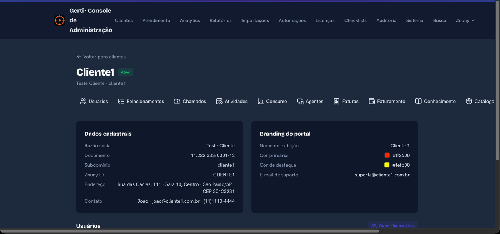

**Por que aconteceu.** Foram dois problemas juntos:

- O botão da tela de filas se chamava **"Relacionamentos"**, o termo do vídeo, enquanto o
  roteiro mandava procurar **"Filas"**.
- Os 13 botões do cliente ficavam numa linha que não quebrava. A página tinha 1.800 px
  de conteúdo numa janela de 1.480, então rolava para o lado, e parte dos botões ficava
  fora da tela.

**O que mudou.**

- Separamos **navegação** de **ações**. "Editar cadastro" e "Novo contrato" ficam ao lado
  do nome. As 11 seções do cliente ganharam uma faixa própria, que quebra linha e não
  vaza.
- O botão agora se chama **Filas**. A tela se chama "Filas de atendimento", e o
  subtítulo lembra que são os "relacionamentos cliente ↔ fila" do vídeo.
- O título do console, que quebrava em três linhas, cabe em uma.

**Como ficou**

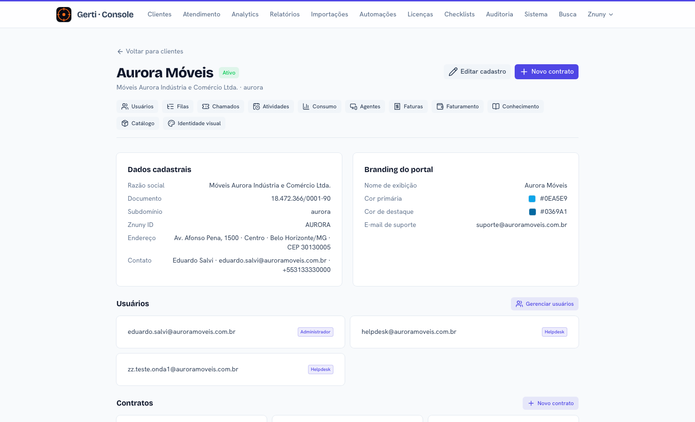

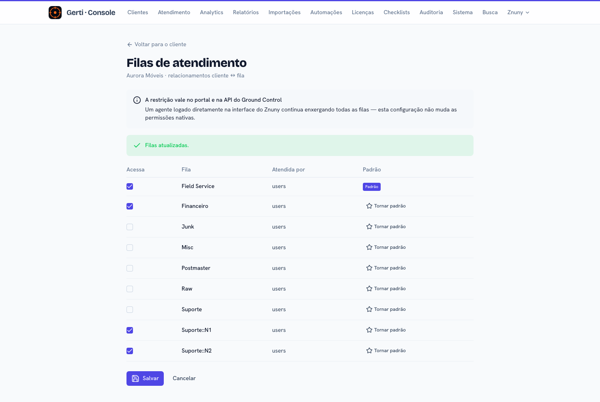

Um teste automático passou a exigir que a página do cliente **não role na horizontal**,
em 1.280 e em 1.480 px, e que o botão Filas esteja visível.

### A4 · "Não é possível seguir, pois o passo 3 não foi finalizado"

Este passo nunca tinha sido testado. Abrimos um chamado pelo portal da Aurora, e ele
nasceu na fila padrão que acabara de ser escolhida no A3. Conferimos isso no próprio
Znuny (passo C3, abaixo).

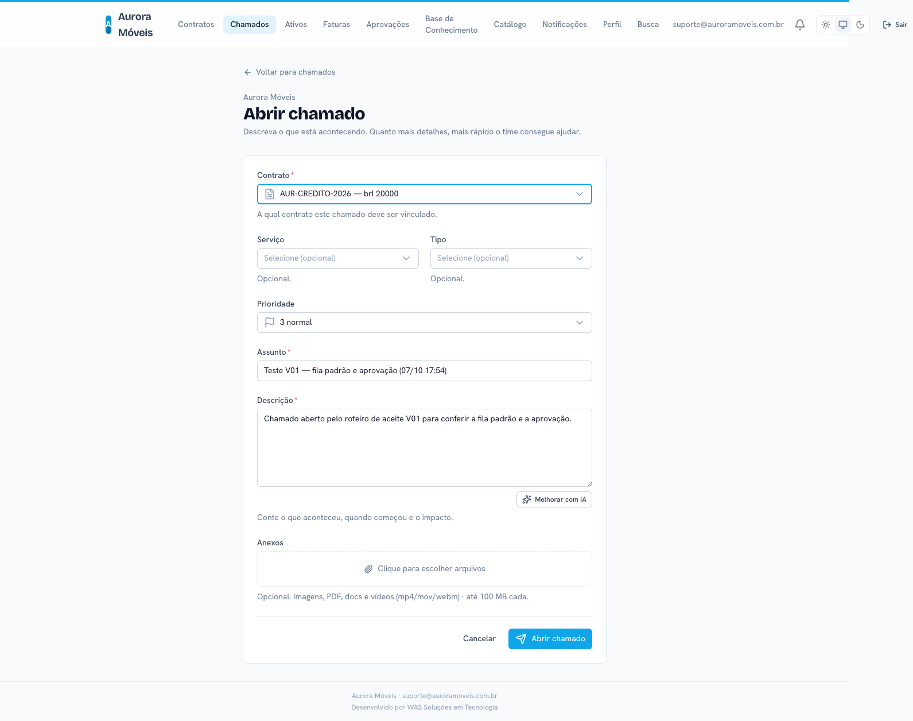

---

## Roteiro B — financeiro

### B5 · "Não aparece o botão de ações"

**O que você viu**

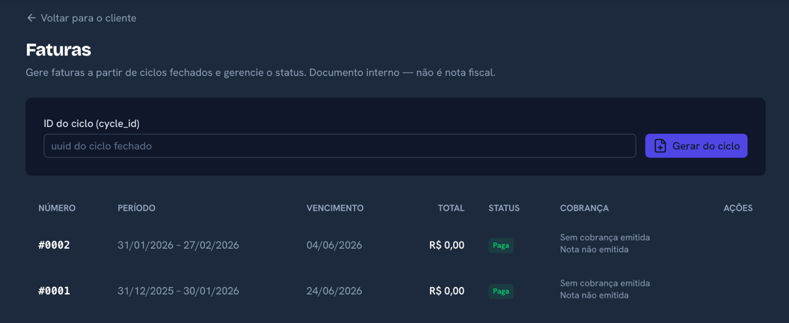

**Por que aconteceu.** O ambiente **não tinha nenhuma fatura com valor**. As duas
existentes eram de R$ 0,00 e já estavam pagas, e o botão de boleto só aparece em fatura
aberta. Para gerar uma fatura nova, a tela pedia o **código interno (UUID) de um ciclo**,
que ninguém de fora tem como saber.

**O que mudou.**

- O campo de código virou um **seletor de ciclos fechados ainda sem fatura**. Cada ciclo
  aparece com período, contrato e o **valor que a fatura terá**, por exemplo
  "01/09/2026 – 30/09/2026 · AUR-PACOTE-2026 · R$ 160,00".
- A tabela de faturas não corta mais a coluna de ações em telas mais estreitas.

**Como ficou.** Geramos a fatura do ciclo de setembro do pacote da Aurora. Ela sai com os
R$ 160 do deslocamento que você lançou no passo B2. Ao clicar em **Emitir boleto**, a
resposta diz que o Asaas está **desligado**, e não dá um erro genérico.

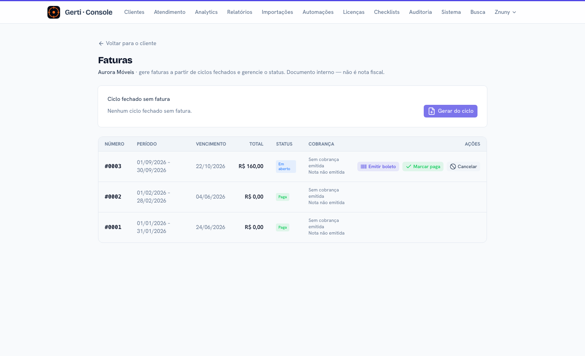

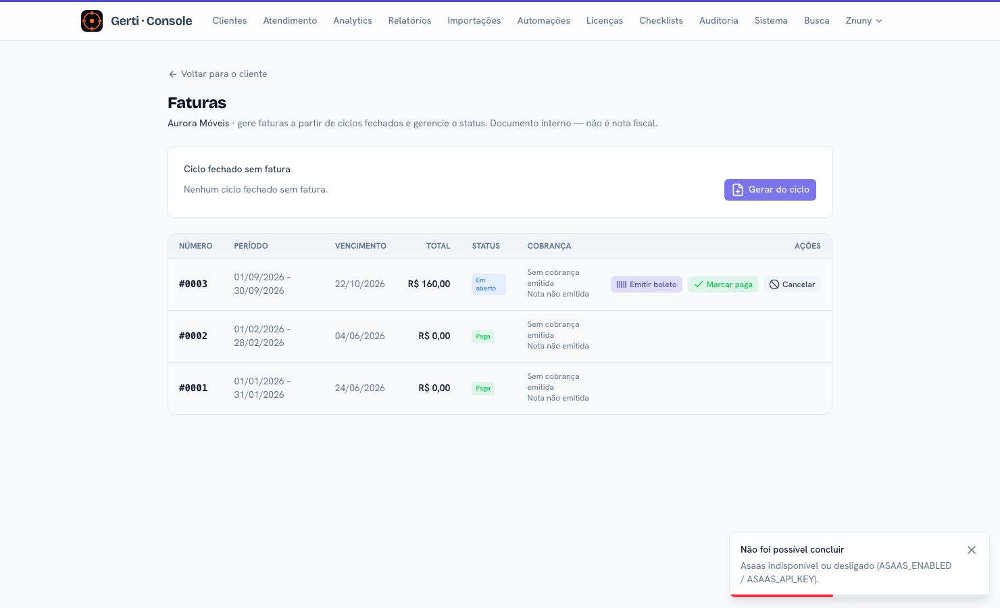

> O R$ 160 só aparece nessa fatura por causa de uma correção que o seu teste não tinha
> como revelar. Veja [O que achamos a mais](#o-que-achamos-a-mais), item 1.

### De brinde: as colunas coladas em "Lançamentos registrados"

No seu print do passo B2, "VALOR" e "LANÇADO POR" estavam grudados. A correção já existia,
mas não estava no ar. Agora está:

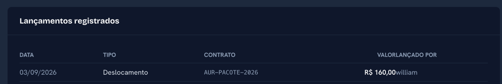

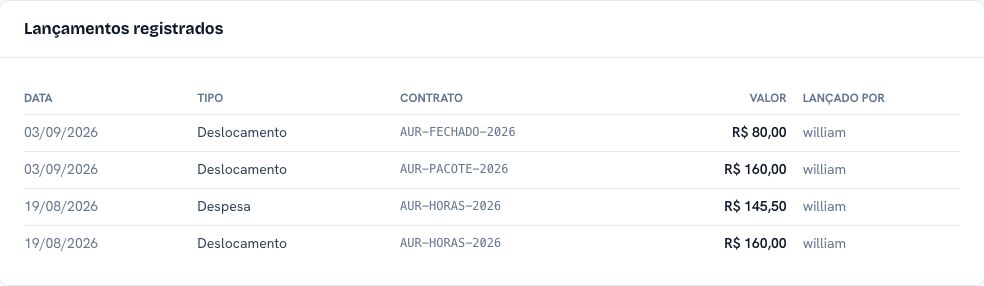

---

## Roteiro C — aprovação de chamados

### C2 · "Usuário não funciona para login"

**O que você viu**

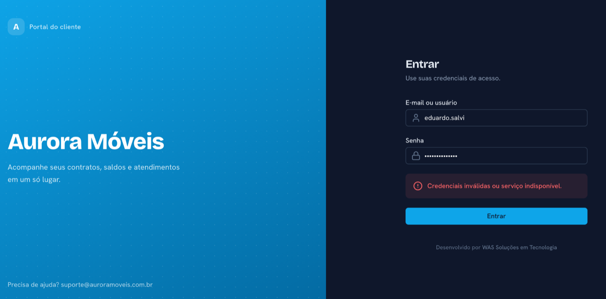

**Por que aconteceu.** **A senha do nosso documento estava errada.** Publicamos
`Gerti@Demo2026`, que é a senha do console. A do portal é `Aurora@Demo2026`. Para piorar,
a mensagem de erro dizia "credenciais inválidas **ou** serviço indisponível", e você não
tinha como saber qual das duas era.

**O que mudou.**

- O documento de entrega foi corrigido e agora nomeia também um usuário de help-desk
  para o passo C6.
- O portal passou a separar os dois casos. Senha errada mostra **"Usuário ou senha
  incorretos."** Queda ou lentidão do servidor mostra **"Serviço indisponível no momento.
  Tente de novo em instantes."**

### C2 a C6 · nunca testados — agora executados

| Passo | Resultado |
|---|---|
| C2 | O chamado aberto pelo portal volta **aguardando aprovação**. |
| C3 | No Znuny nativo, o estado `aguardando aprovacao` é real, e o chamado está na fila padrão da Aurora. |
| C4 | Em **Aprovações**, o botão de confirmar a reprovação fica travado enquanto não há motivo. |
| C5 | Com o motivo escrito, a reprovação é aceita. Uma segunda decisão é recusada (HTTP 409), e **o motivo aparece dentro do chamado, para o autor ler**. |
| C6 | Para a help-desk `mariana.bianchi`, o menu nem mostra "Aprovações", e uma tentativa de aprovar por fora é recusada por falta de permissão (HTTP 403). |

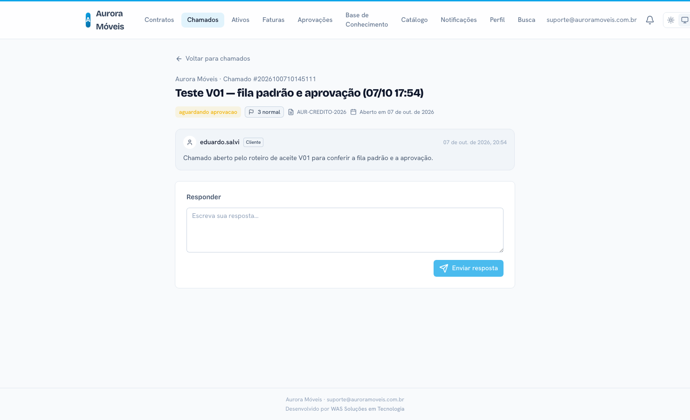

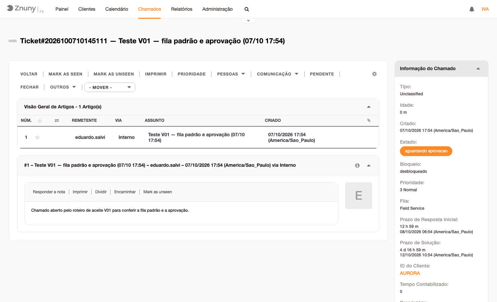

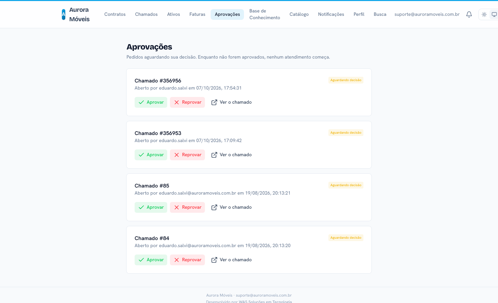

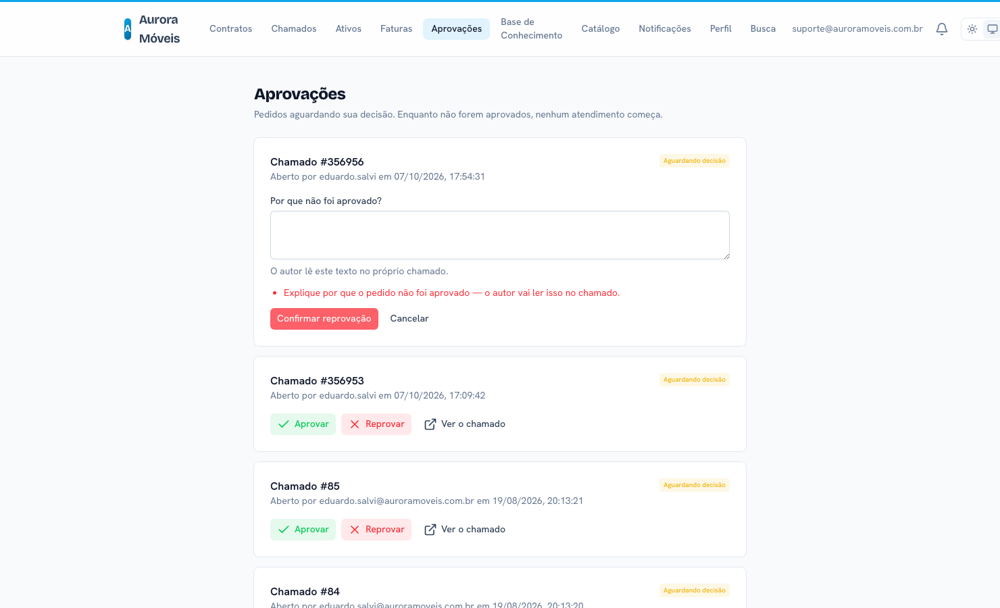

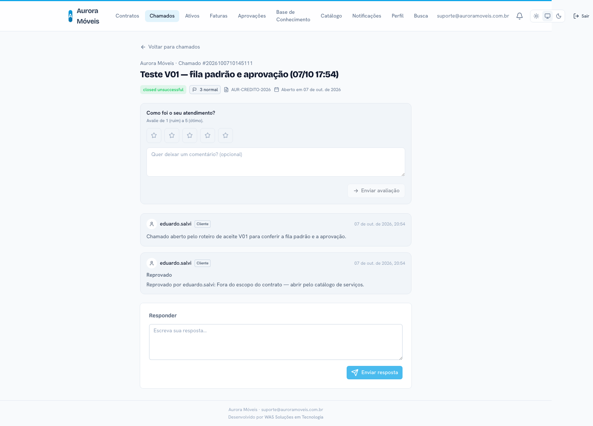

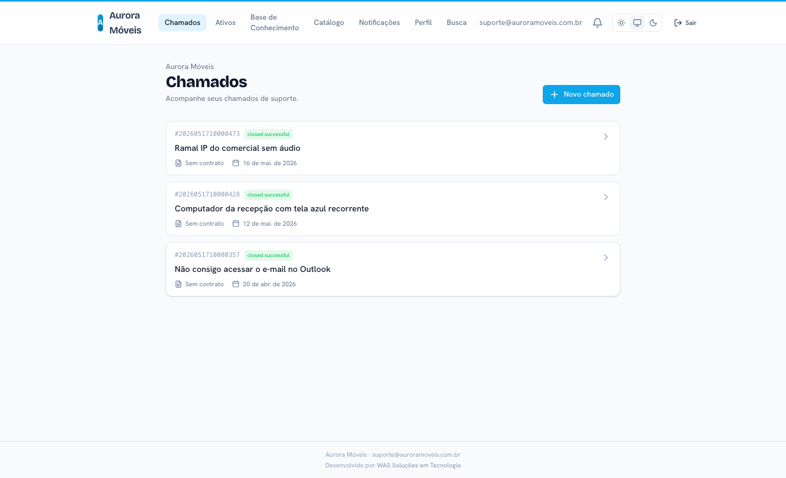

> O C5 **não teria passado** sem uma correção. O motivo da reprovação era gravado como
> nota interna, e o autor nunca o via. Veja [O que achamos a mais](#o-que-achamos-a-mais),
> item 4.

---

## Roteiro D — checklists

### D3 · Buscar "#84" → "Nenhum chamado encontrado"

**O que você viu**

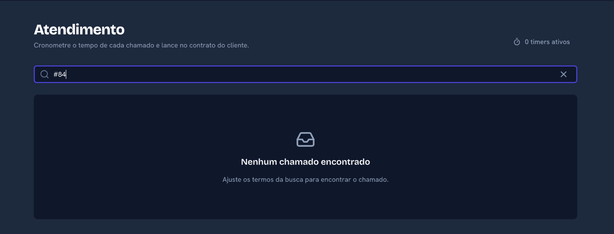

**Por que aconteceu.** Foram dois motivos:

- **A busca do console só procurava no título do chamado.** Nem o número completo
  (`2026081910000081`) achava nada.
- **O nosso roteiro citou o chamado pelo número interno (84)**, enquanto a tela mostra o
  número longo.

**O que mudou.** A busca agora acha o chamado pelo **número interno** (`84` ou `#84`),
pelo **número completo**, pelo **final do número** e pelo **título**. Quando o número
bate exatamente, o chamado vem primeiro. Continua valendo a regra de que a busca nunca
traz chamado de outro cliente. O roteiro agora cita o chamado pelo número e pelo título.

**Como ficou**

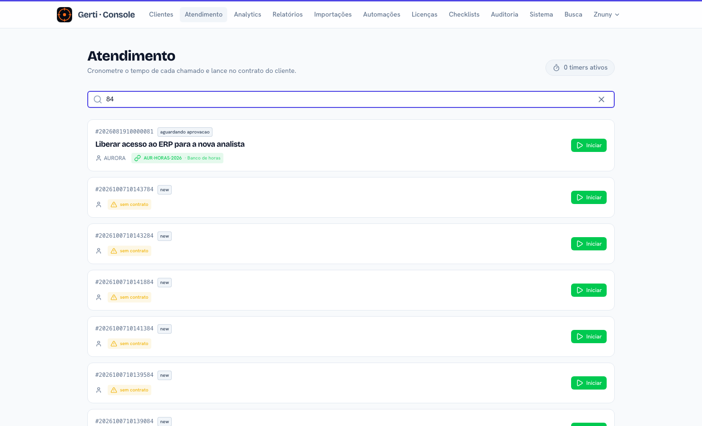

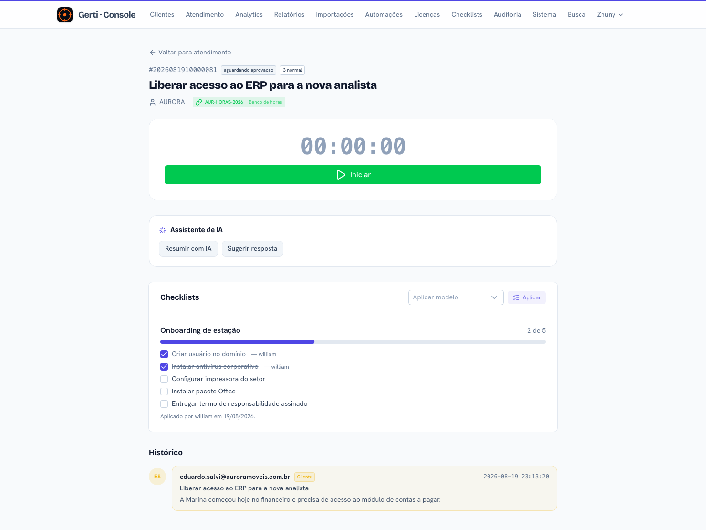

### D4 e D5 · nunca testados — agora executados

- **D4:** marcar um item faz a barra andar, e o item continua marcado depois de
  recarregar a página.
- **D5:** o seletor **não oferece** um modelo que já está aplicado ao chamado; para o
  #84, só aparece "Troca de servidor". Ou seja, a duplicação é barrada na origem. Mesmo
  forçando pela API, reaplicar o mesmo modelo mantém uma lista só. O roteiro foi
  reescrito para descrever o que a tela faz.

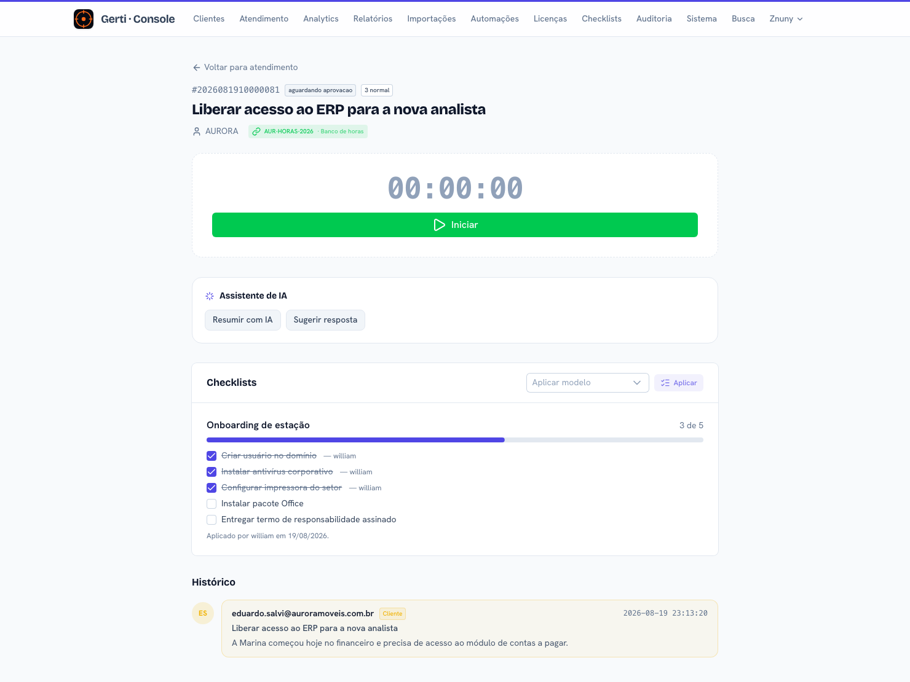

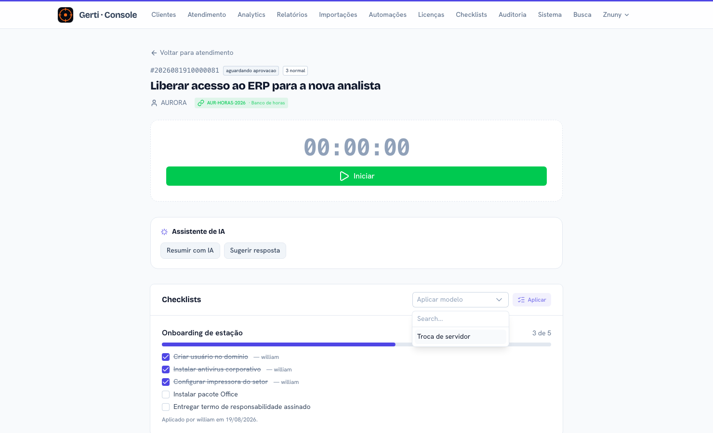

> Deixamos o checklist do chamado em **2 de 5**, como estava, para você refazer.

---

## Roteiro E — nome do calendário

### E1 · "Trava após clicar em Salvar" e tela de erro 500

**O que você viu**

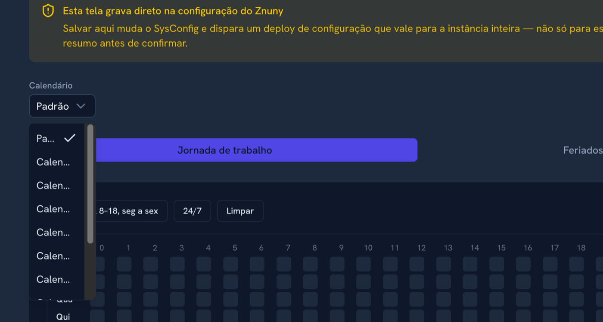

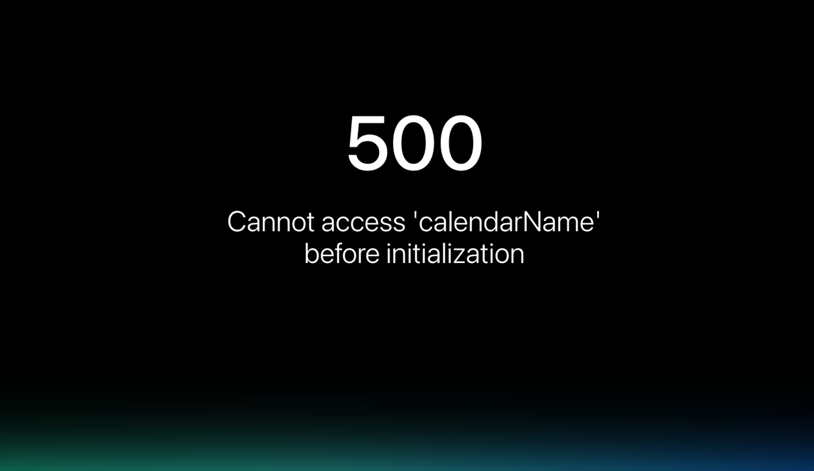

**Por que aconteceu.** Este passo escondia **quatro defeitos em camadas**. Cada um só
aparecia depois que o anterior foi corrigido:

1. **A página dava erro 500 ao ser aberta diretamente**, não só depois de salvar. Um
   valor era usado antes de existir. Nenhum teste nosso abria essa página, e por isso o
   defeito passou.
2. **Toda jornada configurada aparecia vazia.** O Znuny guarda as horas como texto
   ("8", "9"…), e a tela só aceitava número. O calendário Padrão já aparecia vazio no seu
   print. Isso é perigoso: quem confiasse na tela poderia "corrigir" a jornada e apagar a
   verdadeira.
3. **Salvar regravava tudo, mesmo o que não mudou.** Cada gravação no Znuny dispara uma
   reconfiguração da instância inteira. Na segunda, o tempo estourava, e a tela dizia
   "Znuny indisponível", embora parte já tivesse sido gravada.
4. **Nomear um calendário nunca tinha funcionado.** A lista de configurações que o
   console pode alterar no Znuny não incluía o nome do calendário, então toda tentativa
   era recusada. Os três defeitos acima escondiam essa recusa.

**O que mudou.** A página abre normalmente e mostra a jornada real (65 h por semana no
Calendário 3). O salvamento grava **só o que mudou**: trocar só o nome grava só o nome.
O nome passou a ser aceito pelo Znuny, e o seletor mostra os nomes inteiros. O campo de
nome também tinha "Feriados de São Paulo" como texto de exemplo, em cinza, e isso parecia
valor preenchido. Agora o exemplo aparece como "ex.: …".

**Como ficou**

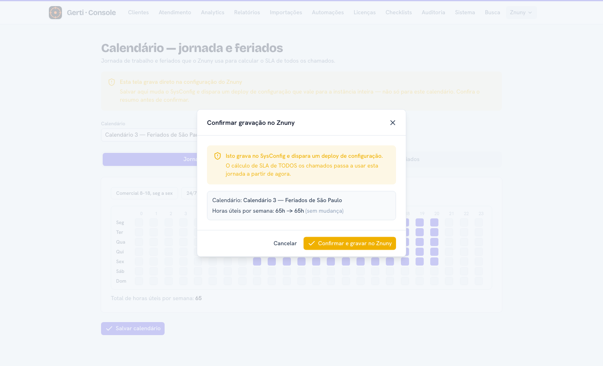

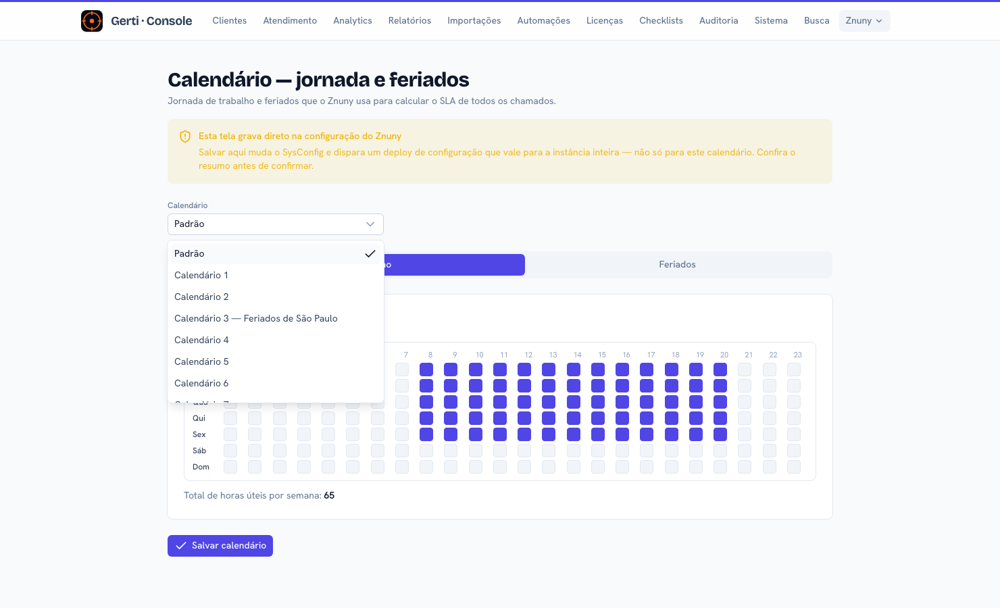

Também criamos um teste automático que **abre diretamente cada página do console** e
falha se alguma der erro. Se ele já existisse em agosto, o defeito 1 teria sido pego
antes de chegar até você.

---

## Roteiro F — licenciamento

### F3 · Não há como atribuir "whatsapp"

**Por que aconteceu.** Esse passo do nosso roteiro estava errado. A tela, de propósito,
**só oferece os módulos que existem hoje**, Chamados e Inventário: um botão de WhatsApp
que não faz nada seria pior do que nenhum. A recusa existe por baixo, para quem tentar
por fora, e lista os módulos válidos. O roteiro foi reescrito.

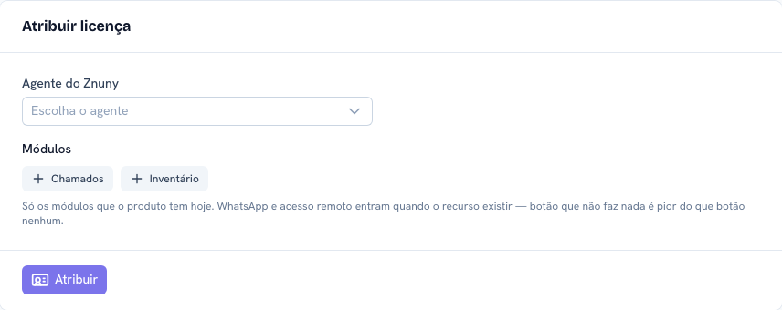

### F5 · O caso da Georgia

**O que você viu**

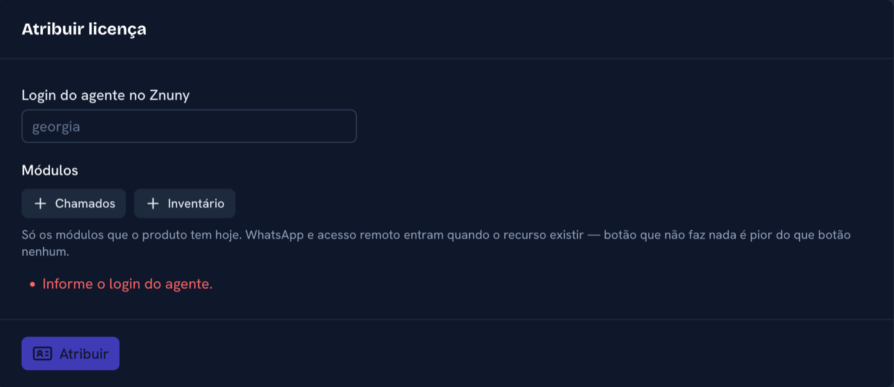

**Por que aconteceu.** Foram quatro problemas:

- **O "georgia" do campo era só um texto de exemplo**, em cinza. Parecia preenchido, e
  por isso veio "Informe o login do agente".
- **A licença aceitava qualquer login digitado.** Das 7 licenças em uso, **6 eram de
  agentes que não existem** no Znuny. O "7 de 9" do quadro era fictício.
- **Não existia uma agente Georgia** para entrar e tentar abrir o inventário.
- **A chave de licenciamento estava desligada**, e só nós podíamos ligá-la.

**O que mudou.**

- O campo livre virou uma **lista dos agentes reais**, e o sistema recusa licença para
  login que não existe.
- Revogamos as 6 licenças fantasmas e licenciamos os 5 agentes reais e a nova agente
  **`georgia`**, que tem **só o módulo de chamados**. O quadro mostra **6 de 9**, um
  número verdadeiro.
- **Ligamos a chave de licenciamento** neste ambiente.
- Revogar uma licença agora pede confirmação.

**Como ficou.** A Georgia entra no console e, ao colar o endereço do inventário direto na
barra do navegador, encontra a **porta trancada**, com o módulo que falta escrito. Por
baixo, as três operações de inventário (listar dispositivos, listar e gerar token de
instalação) respondem "proibido" para ela.

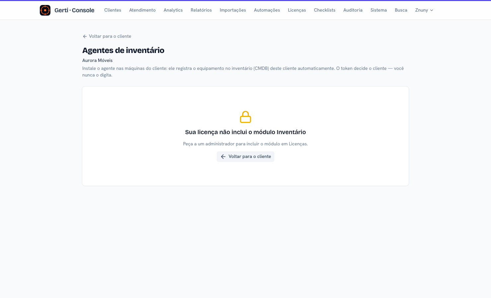

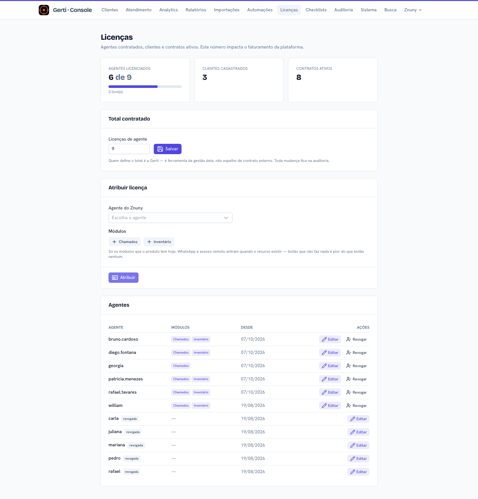

> O bloqueio **ainda não estava completo** quando começamos a verificar. Veja
> [O que achamos a mais](#o-que-achamos-a-mais), item 2.

---

## O que achamos a mais

Refazer o seu roteiro com cuidado revelou defeitos que o teste não tinha como ver.
Todos estão corrigidos, com um teste automático que falhava antes e passa agora:

1. **O lançamento avulso não entrava na fatura de contrato por pacote.** A fatura de um
   pacote de atendimentos descartava todo o consumo, inclusive o deslocamento em reais.
   **Os R$ 160 que você lançou nunca seriam cobrados.** A intenção da regra era não
   cobrar *horas* num pacote, mas ela cortava tudo. Agora as horas continuam fora e o
   que é em reais entra.
2. **A Georgia ainda conseguia operar o inventário.** Só a lista de dispositivos estava
   trancada. As operações de **token de instalação** não exigiam o módulo, então ela
   conseguia gerar um token para instalar o agente de inventário. Além disso, a tela não
   mostrava o bloqueio: exibia listas vazias, como se não houvesse nada.
3. **A tela Znuny → Agentes dizia "Nenhum agente cadastrado"** mesmo com 5 agentes no
   Znuny. Ela lia um formato de resposta que nunca existiu.
4. **O motivo da reprovação era gravado como nota interna**, e o autor nunca o lia. O
   assunto ainda saía como "Automação", com o texto codificado errado. Agora a decisão
   é uma resposta visível ao cliente, assinada por quem decidiu, com o assunto "Aprovado"
   ou "Reprovado".
5. **A jornada aparecia vazia em todo calendário**, e o nome de calendário nunca era
   gravado (detalhes no E1).
6. **Dois campos tinham um exemplo que parecia valor preenchido**: o "georgia" das
   licenças e o "Feriados de São Paulo" do calendário. Os dois foram trocados por
   "ex.: …" ou por uma lista.
7. **Licença dada a login inexistente** (detalhes no F5).

### Uma pendência que precisa de você

**O produto não abre ciclos de cobrança sozinho.** Ele fecha os ciclos que vencem, mas
nada cria o ciclo do mês seguinte. A Aurora só tinha ciclos de janeiro e fevereiro, e
eles tinham sido criados à mão. Sem ciclo, não há fatura nova para cliente nenhum. Para
este teste, criamos à mão o ciclo de setembro do pacote da Aurora e deixamos o
**fechamento real do produto** fechá-lo.

Abrir ciclos automaticamente envolve regras que são suas, e não queremos inventá-las:

- o ciclo começa no **dia 1** ou no **dia de faturamento** do cliente (a Aurora tem
  "dia 5")?
- o saldo de banco de horas **passa** para o ciclo seguinte?
- o ciclo é aberto quando o contrato é **assinado** ou na **virada do mês**?

Com essas três respostas, a abertura automática entra no próximo pacote.

---

## Em que estado deixamos o ambiente

- **A chave de licenciamento está ligada.** Os 5 agentes reais têm chamados e
  inventário, e a `georgia` tem só chamados. Para desligar, basta trocar
  `LICENSE_ENFORCEMENT_ENABLED` para `false` no servidor; é um pedido para nós.
- A **exigência de aprovação** continua ligada na Aurora, e os **chamados #84 e #85**
  aguardam decisão, como no roteiro original.
- O checklist do chamado de ERP voltou a **2 de 5**.
- O **Calendário 3** está com o nome "Feriados de São Paulo". Você pode trocá-lo à
  vontade.
- Existe uma **fatura aberta de R$ 160,00 (#0003)** na Aurora, para o teste de boleto.
- O roteiro automático deixou alguns chamados "Teste V01 …" reprovados na Aurora.

---

## Anexo — os 26 passos, um por um

| Passo | Antes | Agora | Captura (em `assets/teste-v01/depois/`) |
|---|---|---|---|
| A1 Novo cliente | OK | OK | `a1-novo-cliente.png` |
| A2 Editar só o telefone | OK | OK | `a2-usuarios.png` |
| A3 Filas | **NOK** | OK | `a3-filas-salvas.png` |
| A4 Chamado na fila padrão | **NOK** (bloqueado) | OK | `a4-c2-chamado-criado.png` |
| B1 Faturamento | OK | OK | `b1-faturamento.png` |
| B2 Deslocamento sem descrição | OK | OK | `b2-sem-descricao.png` |
| B3 Minutos num deslocamento | OK | OK | `b3-minutos.png` |
| B4 Bolsa × banco de horas | OK | OK | `b4-bolsa.png` |
| B5 Emitir boleto | **NOK** | OK | `b5-emitir-boleto.png` |
| C1 Exigir aprovação | OK | OK | `c1-aprovacao-ligada.png` |
| C2 Chamado aguardando aprovação | **NOK** | OK | `c2-aguardando-aprovacao.png` |
| C3 Estado real no Znuny | **NOK** (bloqueado) | OK | `c3-znuny-estado.png` |
| C4 Reprovar sem motivo | **NOK** (bloqueado) | OK | `c4-reprovar-sem-motivo.png` |
| C5 Reprovar com motivo; decidir de novo | **NOK** (bloqueado) | OK | `c5-motivo-no-chamado.png` |
| C6 Help-desk tenta aprovar | **NOK** (bloqueado) | OK | `c6-helpdesk-aprovacoes.png` |
| D1 Checklists | OK | OK | `d1-checklists.png` |
| D2 Modelo sem item | OK | OK | `d2-modelo-vazio.png` |
| D3 Abrir o chamado do checklist | **NOK** | OK | `d3-chamado-84.png` |
| D4 Marcar mais um item | **NOK** (bloqueado) | OK | `d4-checklist-apos-recarregar.png` |
| D5 Reaplicar o mesmo modelo | **NOK** (bloqueado) | OK | `d5-modelos-oferecidos.png` |
| E1 Nome do calendário | **NOK** | OK | `e1-seletor-com-nome.png` |
| F1 Licenças | OK | OK | `f1-licencas.png` |
| F2 Teto de licenças | OK | OK | `f2-teto.png` |
| F3 Módulo "whatsapp" | **NOK** | OK | `f3-modulos.png` |
| F4 Reduzir para 1 | OK | OK | `f4-reduzir-para-1.png` |
| F5 O caso da Georgia | **NOK** | OK | `f5-georgia-url-direta-inventario.png` |
